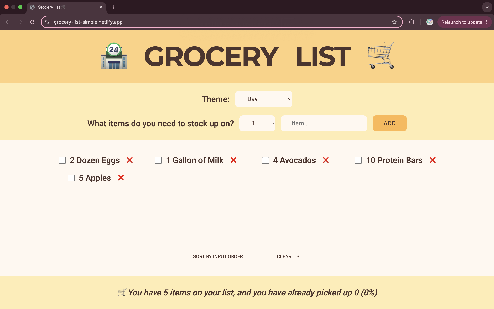
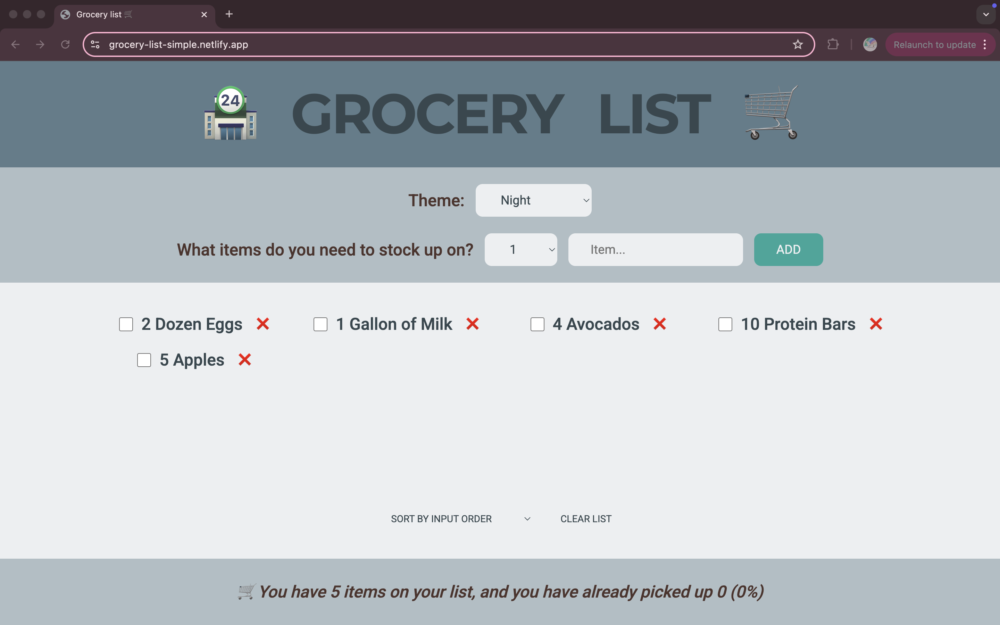

# Grocery List React App

A simple, responsive grocery list application built with React. Manage your grocery items, mark them as packed, sort by various criteria, and clear your list—all in a clean, modern interface.

## Features

- **Add Items:** Quickly add items with a description and quantity.
- **Toggle Packed Status:** Mark items as packed or unpacked.
- **Sort Options:** Sort your list by input order, description, or packed status.
- **Clear List:** Remove all items from your list with a single click.
- **Responsive Design:** Works well on all screens.
- **Theme Switching:** Switch between day and night modes for different moods and times of day.

## Demo

Check out the live demo: [Grocery List App](https://grocery-list-simple.netlify.app/)

  
  

## Installation

To run this project locally, follow these steps:

1. Clone the repository:
   ```bash
   git clone https://github.com/your-username/grocery_list.git
2. Navigate to your project directory:
3. Install dependencies:
   ```bash
   npm install
4. Start the development server
   ```bash
   npm run dev

